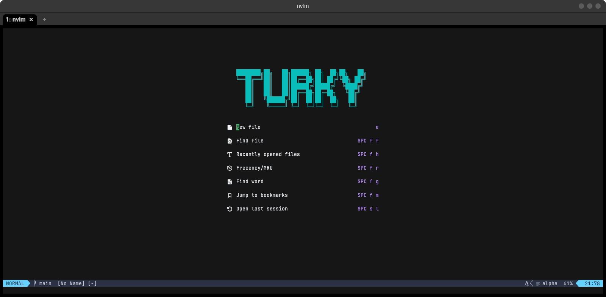
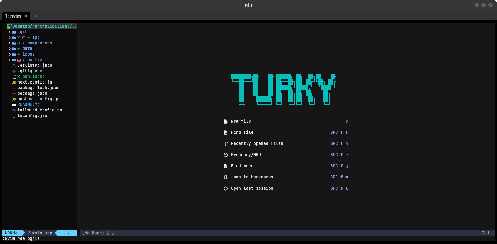
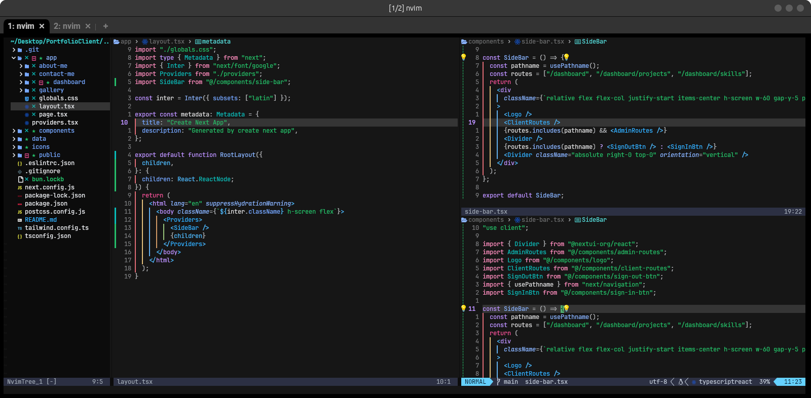

# Neovim
Hello my friend, this's my neovim's configurations, it's public for any one who interested
## Features
1- neovim tree plugin (file explorer) 
2- startup with dashboard page 
3- split screen and navigate between 
4- typescript server language 
5- Eslint 
6- codeium AI assistant 
7- snippet engine & autocompletion 
8- lsp config 
9- vs code matrial icons 
10- available themes (nightfly, nightfox, aura) 
11- formatting & linting 
12- treesitter configuration 
13- autoclose parens, brackets, quotes, etc... 
14- git integration 
15- indent rainbow colors 
### Screenshots

